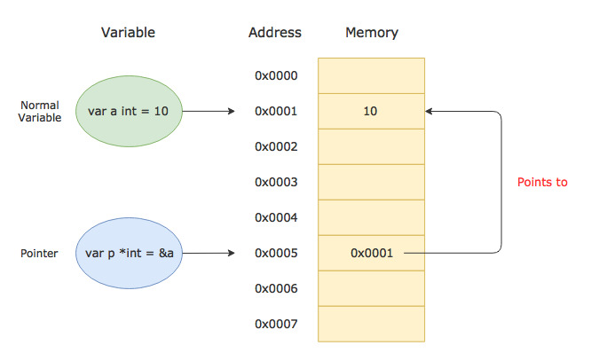

% Pointers and Interfaces
% Tom Arrell
% January 27

---

# Last week...

We covered the map data structure. We saw how we could create a new map instance with a separate key and value type, how we could insert into a map, and how we could get values from a map.

We also covered methods on a struct.

---

# This week

* Pointers
  * what are they?
  * nil value
  * why do we want to use them?
  * operations
  * challenge
* Interfaces
  * what are they?
  * implicit implementation
  * challenge

---

# Pointers

Pointers are like street addresses, except for your computer's memory. They are usually allocated on the your application's heap (don't worry about this too much just yet).



--- 

# Pointers

You can think of a pointer as a modifier to a type. Pointers can contain one of two possible values, `nil` **OR** an instance of the underlying type.

e.g.

```go
var numOfSheep *int
var numOfBirds *int
*numOfBirds = 20

fmt.Println(numOfSheep) // <nil>
fmt.Println(numOfBirds) // 0xc000098008
```

---

# Pointer Uses

Pointers are used when you would like to pass around something **without copying** the underlying memory. An example of when copying occurs is when you *pass arguments to a function*. Copying large blocks of memory between function calls can sometimes be expensive, so we sometimes want to prevent this from happening.

This allows you to refer to the same concrete thing in memory, and have changes to this thing effect other parts of your program.

---

# Pointer Operations

To get the address of a value, you can use the `&` operator. You can then assign this to another value.

To convert a pointer into the value at the address, you need to *dereference* the pointer. You can do this with the `*` operator preceding the value.

e.g.
```go
numOfBirds := 20 
ptrNumOfBirds := &numOfBirds

fmt.Println(*ptrNumOfBirds) // 20

numOfBirds = 10 // change the value of the variable

fmt.Println(*ptrNumOfBirds) // 10
```

---

# Dereferencing Pointers

You need to be careful with pointers. If you accidentally attempt to dereference a pointer which is `nil` (i.e. has no value) in your code, then you will trigger a runtime panic, and your program will crash.

This is because the compiler *cannot tell ahead of time* whether or not a value will be nil or not, therefore it must do the check at runtime.

In order to prevent accidental dereferences, whenever you're not sure if a pointer type has a value, you need to check if it is `== nil`.

e.g.

```go
if myVariable == nil {
  // handle the nil condition...
}

// it's safe to use...
```

---

# Challenge

Write two functions with the following signatures:

```go
func derefString(str *string) string
func derefInt(val *int) int
```

Where the functions take in a pointer type, and return a non-pointer type. If the value passed in is `nil`, your function should return the **empty value**.

---

# Interfaces

Interfaces are a unique type in Go that describe functionality.

i.e. if something can do this, then it can be used here.

A type can implement multiple interfaces. For instance, a collection can be sorted by the routines in package sort if it implements sort.Interface, which contains `Len()`, `Less(i, j int) bool`, and `Swap(i, j int)`.

---

# Interface Syntax

To declare a new interface in Go, you create it similarly to a struct, however, instead of defining values on the type, you define function signatures.

```go
type Stringer interface {
  String() string
}
```

Therefore, any type that defines a `String` method with the same signature will be able to be used in place of the Stringer type.

---

# Interface implementation

An example of a type implementing the `Stringer` interface.

```go
type Stringer interface {
  String() string
}

type myType struct {}

func (m myType) String() string {
  return "Hello, World!"
}
```

Notice that we never specifically have to say that our `myType` type implements the `Stringer` interface. This is done by the compiler automatically. This is rather unique to Go.

---

# Challenge

Define 3 types, a `Dog`, a `Cat` and a `Snake`. For each of these three types, satisfy the interface below.

```go
type Speaker interface {
  Speak() string
}

func speak(sp Speaker) {
  fmt.Println(sp.Speak())
}

func main() {
  speak(Cat{}) // Meow
  speak(Dog{}) // Woof
  speak(Snake{}) // Hiss
}
```
